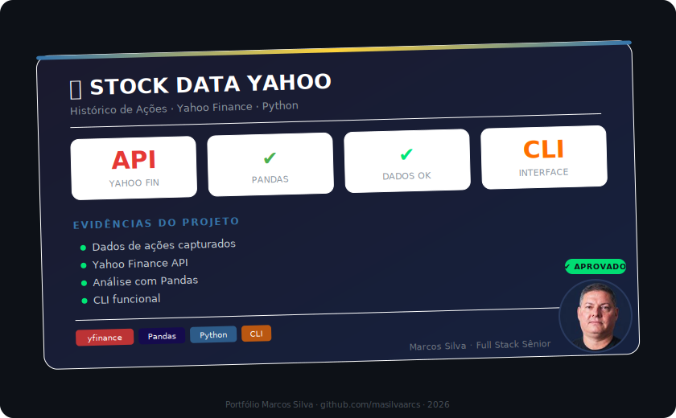

# Stock Data - Yahoo Finance

Script Python para consultar dados históricos de ações usando a API do **Yahoo Finance** (yfinance).

## Funcionalidades

- Consulta dados de qualquer ação por ticker
- Períodos configuráveis (1d a max)
- Cálculo de variação percentual no período
- Argumentos via CLI

## Stack

- Python 3.x
- yfinance
- Pandas
- Pytest

## Como executar

```bash
pip install -r requirements.txt

# Consulta padrão (Apple, último mês)
python busca_dados_acoes.py

# Customizado
python busca_dados_acoes.py --ticker MSFT --period 3mo
```

## Testes

```bash
pytest
```

## Autor

**Marcos Silva** — [LinkedIn](https://www.linkedin.com/in/marcosprogramador/)

## 📸 Evidências

<p align="center">
  
</p>

